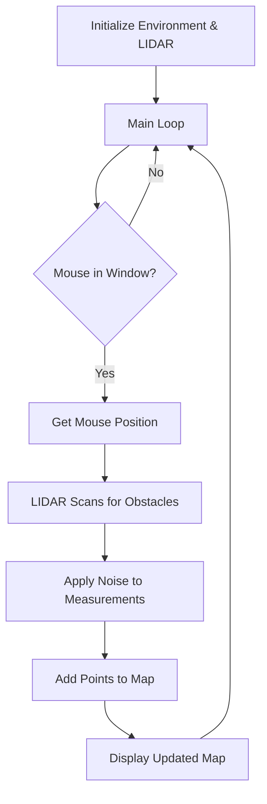

# 2D LIDAR Mapping Simulation

This project is a 2D LIDAR (Light Detection and Ranging) sensor simulation using Pygame.

## Overview

The simulation allows you to control a virtual LIDAR sensor with your mouse to scan in a 2D environment. As you move the cursor around, the virtual LIDAR sensor detects obstacles(black pixel in map) and builds a point cloud representation of the environment in real-time.



## Installation

1. Clone this repository or download the source code
2. Install the required dependencies:

```bash
pip install pygame numpy
```

3. Make sure you have a map image file named 'map.png' in the same directory

## How to Use

1. Run the script:

```bash
python main.py
```

2. Move your mouse cursor within the window to position the LIDAR sensor
3. The red dots represent detected obstacle points
4. To quit the simulation, close the window

## Code Structure

- `buildEnvironment`: Creates and manages the simulation environment
- `LidarSensor`: Simulates the LIDAR sensor behavior
- `add_uncertainty`: Adds realistic noise to sensor measurements

## Configuration

You can modify these parameters in the code:

- Sensor range: Change the `range` parameter when initializing the `LidarSensor`
- Sensor uncertainty: Adjust the `uncertainty` values for distance and angle
- Scan resolution: Modify the number of samples in the `np.linspace()` function
- Map dimensions: Change the dimensions when initializing `buildEnvironment`

## Notes

- The sensor only works when the mouse is focused on the simulation window
- Black pixels in the map image represent obstacles

## Citation
- This code is inspired from https://www.youtube.com/watch?v=JbUNsYPJK1U&t=143s&ab_channel=HobbyCoding


